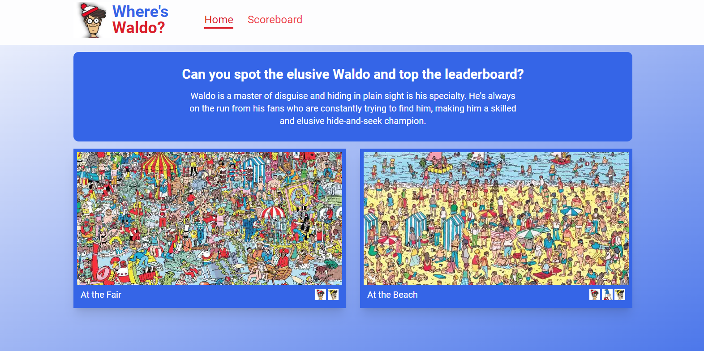
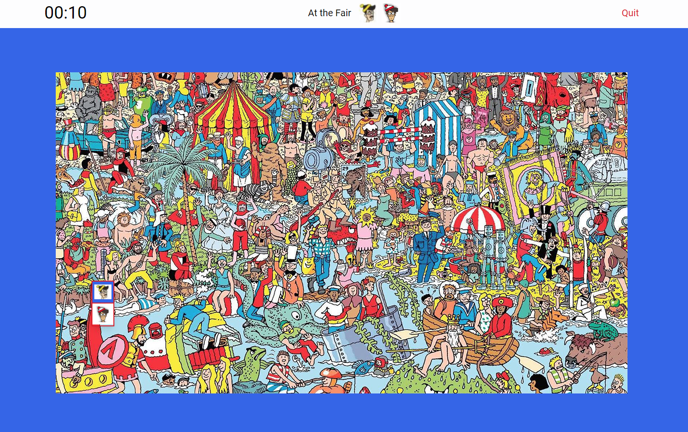

# Where's Waldo

_Where's Waldo_ is a browser game to find characters in a busy image. Players can also record their results on the scoreboard.

## Gameplay

Players can select a level to play from the homepage. In the game player aught to find the character(s) as quickly as possible.
After success, a screen appears, asking for the player to enter his/her name for the scoreboard. The game then takes the player
to the scoreboard page. Go back to the homepage to try another level!

 

    

Where's Waldo home page, where players can pick a game to play.

 
 

    

After picking a game to play, the game starts.

 

## Technologies used

The game was realized with React, using Firebase as backend for game images, data and player scores.

Here's a list of technologies used:

- Vite
- React
- Typescript
- Eslint+prettier
- Tailwind
- Firebase hosting/storage/firestore
- Tanstack Query
- React Router
- Zod
- React testing library for unit/integration tests
- Cypress for e2e tests
- Axe for accessibility tests
- Firebase emulator for testing and development
